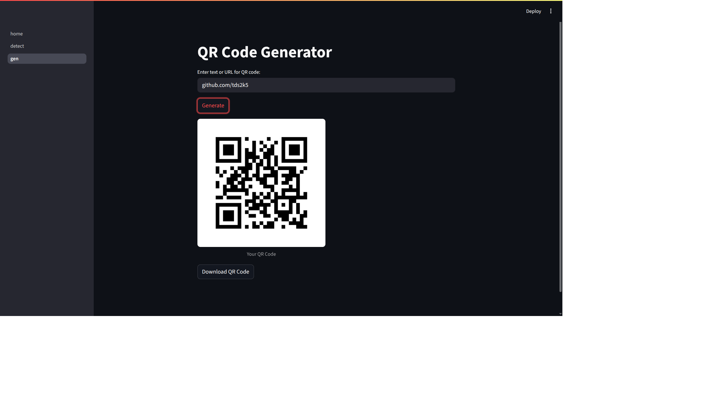

# QR Code Generator and Decoder

Quick Response code tool built with Streamlit - fast and convenient usage.

## Features

- Detect : Upload a PNG, JPG or JPEG file containing a QR code and instantly decode its content as a text/link.

- Generate : Provide text or link as an input, and generate custom QR code for the same, can also download it for use.

## Glance



## Setup

1. Clone this repo:

   ```bash
   git clone https://github.com/TDS2K5/qrbros.git
   ```

2. Activate virtual environment (venv)

3. Install requirements:

   ```bash
   pip install -r requirements.txt
   ```

4. Run the app:

   ```bash
    streamlit run home.py
   ```
